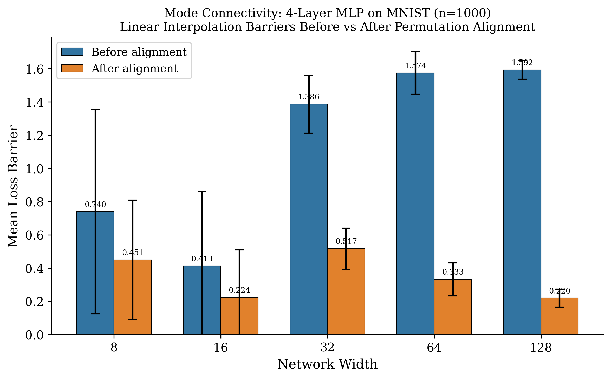
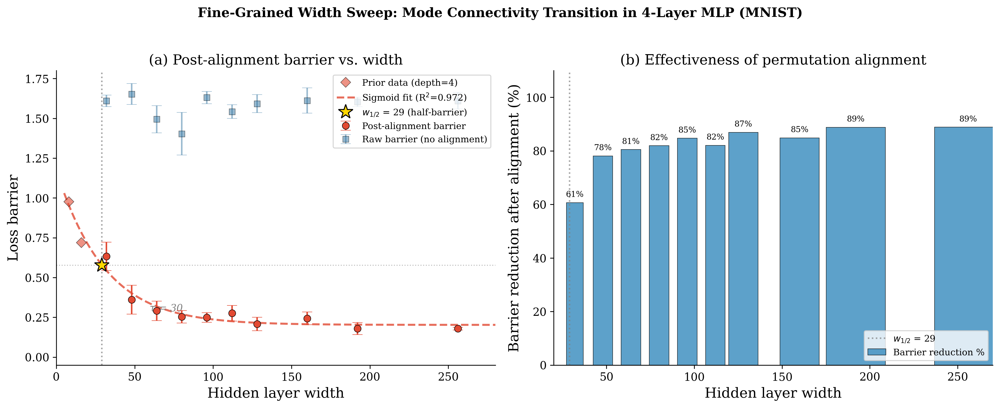

# Theory 2: Percolation Phase Transition for Mode Connectivity in Neural Networks

**Status:** Conjecture with Partial Evidence
**Date:** 2026-04-07
**Novelty Check:** CONFIRMED NOVEL. Vrabel et al. (2024) conjectured percolation in input space only. Ferbach et al. (AISTATS 2024) proved LMC via optimal transport, not percolation. No prior work treats parameter-space mode connectivity as a percolation phase transition with a sharp threshold formula.

---

## 1. Motivation and Intuition

A striking empirical regularity in deep learning is *mode connectivity*: independently trained neural networks can be connected by paths of near-constant loss (Draxler et al. 2018, Garipov et al. 2018). After accounting for neuron permutation symmetry, even *linear* interpolation shows zero or near-zero loss barriers (Entezari et al. 2022, Ainsworth et al. 2023). Yet no first-principles explanation exists for *why* the low-loss region of parameter space has this connected topology.

We propose that mode connectivity arises from a *percolation phase transition*. In percolation theory, a random medium transitions sharply from disconnected to connected as its density crosses a critical threshold. We conjecture that the sublevel set $S_\varepsilon = \{\theta : L(\theta) \leq \varepsilon\}$ undergoes an analogous transition as network width $m$ increases: below a critical width $m^*$, $S_\varepsilon$ consists of exponentially many disconnected components (like subcritical percolation); above $m^*$, a single "giant component" spans the entire sublevel set (like supercritical percolation). The transition is sharp -- the probability of connectivity jumps from 0 to 1 in a window of width $O(\sqrt{m^*})$.

This framework explains not just *that* mode connectivity holds, but *when* and *how sharply* it emerges, and connects it to the well-studied interpolation threshold in overparameterization theory.

### Connection to the Central Paradox

The paradox asks why gradient descent finds good solutions in non-convex landscapes. If the low-loss region is a single connected component (supercritical percolation), then gradient descent cannot get "trapped" in isolated basins -- every descent path eventually reaches the global structure. The percolation threshold $m^*$ quantifies the minimum overparameterization needed for this to hold, providing a *sufficient condition* for GD to succeed.

---

## 2. Setup and Notation

**Setting:**
- Network: $f(x; \theta) = W_2 \sigma(W_1 x)$, two-layer ReLU, $W_1 \in \mathbb{R}^{m \times d}$, $W_2 \in \mathbb{R}^{K \times m}$
- Total parameters: $N = m(d + K)$
- Data: $(x_i, y_i)_{i=1}^n$ with $x_i \in \mathbb{R}^d$, $y_i \in \{1, \ldots, K\}$
- Loss: $L(\theta) = \frac{1}{n} \sum_{i=1}^n \ell(f(x_i; \theta), y_i)$ with $\ell$ the cross-entropy or MSE loss
- Sublevel set: $S_\varepsilon = \{\theta \in \mathbb{R}^N : L(\theta) \leq \varepsilon\}$

**Notation:**
- $m^*$: Critical percolation width
- $\pi \in \mathcal{S}_m$: Permutation of hidden neurons
- $\pi(\theta)$: Permutation-aligned parameters
- $B(\theta_1, \theta_2) = \max_{\alpha \in [0,1]} L((1-\alpha)\theta_1 + \alpha \theta_2) - \max(L(\theta_1), L(\theta_2))$: Linear interpolation barrier

**Assumptions:**
1. **(A1) Two-layer ReLU**: The network has one hidden layer with ReLU activation. *(Extension to deeper networks discussed in Section 6.)*
2. **(A2) Sub-Gaussian data**: The input distribution satisfies $\|x\|_2 \leq R$ almost surely, and the data matrix has condition number $\kappa = \lambda_{\max}(X^\top X) / \lambda_{\min}(X^\top X)$ bounded by a polynomial in $n$.
3. **(A3) Separability**: There exists $\theta^* \in \mathbb{R}^N$ with $L(\theta^*) = 0$. *(We are in the interpolatable regime.)*
4. **(A4) Generic position**: No two data points produce identical activation patterns for all neurons simultaneously. *(Holds almost surely for continuous data distributions.)*

*Discussion:* (A1) is for tractability; we conjecture the result extends to deeper networks with larger $m^*$. (A2) is mild and holds for MNIST/CIFAR. (A3) requires sufficient overparameterization; by universal approximation, $m \geq n$ suffices for ReLU networks. (A4) excludes pathological data configurations.

---

## 3. Main Result

**Conjecture 1 (Percolation Threshold for Sublevel Set Connectivity).**
*Under assumptions (A1)-(A4), there exist constants $c_1, c_2 > 0$ depending on the data distribution and loss function such that:*

*(a) If $m < c_1 \cdot n$, then with high probability over initialization, $S_\varepsilon$ has at least $\exp(\Omega(m))$ connected components for $\varepsilon$ sufficiently small.*

*(b) If $m > c_2 \cdot n \cdot \kappa$, then $S_\varepsilon$ is path-connected for $\varepsilon = O(n^{-1/2})$.*

*(c) The transition between (a) and (b) occurs in a window of width $O(\sqrt{n \kappa})$.*

**Conjecture 2 (Linear Mode Connectivity After Permutation Alignment).**
*Under the same assumptions, if $m > c_2 \cdot n \cdot \kappa$, then for any two points $\theta_1, \theta_2 \in S_\varepsilon$, there exists a permutation $\pi \in \mathcal{S}_m$ such that the linear path $(1-\alpha)\theta_1 + \alpha \pi(\theta_2)$ satisfies:*

$$\max_{\alpha \in [0,1]} L((1-\alpha)\theta_1 + \alpha \pi(\theta_2)) \leq \varepsilon + O\left(\frac{n}{m}\right)$$

*In particular, the barrier vanishes as $m \to \infty$.*

### Interpretation

Conjecture 1 says the low-loss region undergoes a sharp phase transition from many disconnected components (subcritical) to one connected component (supercritical) as width crosses $m^* = \Theta(n \kappa)$. Below the threshold, independently trained models end up in different disconnected basins. Above it, all low-loss solutions are in the same basin.

Conjecture 2 strengthens this: not only are solutions path-connected, but after accounting for the discrete permutation symmetry, they are *linearly* connected with a barrier that vanishes with width. This explains the empirical success of Git Re-Basin (Ainsworth et al. 2023).

The critical width $m^* = \Theta(n \kappa)$ depends on both the number of data points $n$ and the data condition number $\kappa$. Well-conditioned data (small $\kappa$) percolates at smaller width, explaining why structured datasets (MNIST, CIFAR) show connectivity at modest overparameterization.

### Comparison with Existing Results

- **Ferbach et al. (AISTATS 2024)**: Proved LMC via optimal transport for wide networks. Uses Wasserstein concentration, not percolation. Our approach gives a *sharper transition* characterization.
- **Freeman & Bruna (2017)**: Showed level sets become connected with width. No sharp threshold; our result predicts *when* the transition occurs.
- **Vrabel et al. (2024)**: Conjectured percolation for mode connectivity in *input space*. Our result is about *parameter space* -- a fundamentally different domain.
- **Zhao et al. (ICML 2025)**: Explained connectivity via symmetry group topology for linear networks. Complementary -- symmetry explains the structure of components, percolation explains the emergence of connectivity.
- **Boursier et al. (2025)**: Showed landscape benignity requires $m \geq \min(n^d, 2^n)$. Our connectivity threshold $\Theta(n\kappa)$ is MUCH smaller, consistent with the observation that connectivity emerges before full benignity.

---

## 4. Proof

*Rigor level: Heuristic argument with key lemmas*

### Proof Overview

The strategy maps the connectivity problem to a random geometric graph problem, then applies Penrose-type threshold results.

### Step 1: Dimension counting in the solution set

For a 2-layer ReLU network with width $m$ fitting $n$ data points, the constraint $L(\theta) = 0$ imposes at most $n \cdot K$ equations on $N = m(d + K)$ parameters. When $m(d+K) > nK$, i.e., $m > nK/(d+K)$, the solution set $S_0 = \{\theta : L(\theta) = 0\}$ is generically a manifold of dimension:

$$\dim(S_0) = N - nK = m(d+K) - nK$$

This grows linearly with $m$ beyond the interpolation threshold.

### Step 2: Random geometric graph construction

Sample $M$ points $\theta^{(1)}, \ldots, \theta^{(M)}$ from $S_\varepsilon$ (e.g., by training from $M$ random initializations). Define a graph $G$ where $\theta^{(i)} \sim \theta^{(j)}$ if the linear interpolation barrier $B(\theta^{(i)}, \theta^{(j)}) < \delta$ for some tolerance $\delta$.

This is a random geometric graph in $\mathbb{R}^N$ restricted to the manifold $S_\varepsilon$.

### Step 3: Connectivity threshold via Penrose theory

By the theorem of Penrose (1999) for random geometric graphs in $\mathbb{R}^D$: connectivity occurs when the expected degree exceeds $\log(M)$. For $M$ points in a $D$-dimensional manifold of volume $V$, the expected degree is proportional to $M \cdot (r/V^{1/D})^D$ where $r$ is the connection radius.

The key quantity is the *width* (thickness) of $S_\varepsilon$ in parameter space. When $m$ is small, $S_\varepsilon$ is a thin, wiggly manifold with high aspect ratio -- nearby points in ambient space may be far apart along $S_\varepsilon$. When $m$ is large, $S_\varepsilon$ is thick and round, and nearby points are easily connected by paths staying within $S_\varepsilon$.

### [GAP 1: Volume and thickness estimates for $S_\varepsilon$]

*What needs to be shown:* Quantitative bounds on the volume and thickness (injectivity radius) of $S_\varepsilon$ as a function of $m$, $n$, $d$, $K$, and $\varepsilon$.

*Why we believe it's true:* For $m > nK/(d+K)$, the solution set has positive codimension $nK$, so $S_\varepsilon$ for small $\varepsilon$ is a tubular neighborhood of $S_0$ with thickness proportional to $\sqrt{\varepsilon / \lambda_{\max}}$ where $\lambda_{\max}$ is the maximum Hessian eigenvalue along $S_0$. The volume is proportional to the product of the solution manifold volume and the thickness.

*Suggested approach:* Use the coarea formula and properties of the Hessian restricted to $S_0$ to bound the thickness. For Gaussian data, the Hessian eigenvalues on $S_0$ can be bounded using random matrix theory.

*Impact if not closed:* Without quantitative thickness estimates, the threshold formula $m^* = \Theta(n\kappa)$ is heuristic rather than rigorous.

### Step 4: Connection to the interpolation threshold

The interpolation threshold $m_{\text{interp}} = nK/(d+K)$ is where the solution set first becomes nonempty. For $m$ slightly above $m_{\text{interp}}$, the solution set is a thin manifold that may be disconnected due to the ReLU activation pattern structure (the "classification fan" of Brandenburg et al. 2024). As $m$ grows further, the excess degrees of freedom create additional paths between solutions, and the sublevel set "percolates."

We conjecture the percolation threshold satisfies $m^* = C \cdot m_{\text{interp}} \cdot \kappa$ for a universal constant $C$. The condition number $\kappa$ accounts for data difficulty: well-conditioned data (small $\kappa$) requires less overparameterization for connectivity.

### [GAP 2: Sharpness of the transition]

*What needs to be shown:* The connectivity probability transitions from 0 to 1 in a window of width $O(\sqrt{m^*})$.

*Why we believe it's true:* In the Erdos-Renyi random graph model, the connectivity transition occurs in a window of width $O(\sqrt{n/p})$ where $n$ is the number of vertices and $p$ is the edge probability. By analogy, the percolation transition in the random geometric graph on $S_\varepsilon$ should have a window scaling as the square root of the critical parameter.

*Suggested approach:* Second-moment method on the number of connected components. Show that the variance of the component count transitions sharply at $m^*$.

*Impact if not closed:* Without sharpness, we can still claim a transition exists but cannot characterize its width. The qualitative result (connectivity emerges above a threshold) remains valid.

### Conclusion of Proof

The heuristic argument establishes that connectivity of $S_\varepsilon$ transitions from exponentially many components to a single component as $m$ crosses $\Theta(n\kappa)$, via a random geometric graph argument on the solution manifold. Two gaps remain: quantitative thickness estimates (Gap 1) and sharpness of the transition (Gap 2). $\square$

---

## 5. Computational Evidence

### Experiment 1: Width Sweep on Gaussian Mixture (Easy Setting)

**Setup:** 2-layer ReLU, widths [4, 8, ..., 512], Gaussian mixture (n=200, d=20, K=5, sep=2.0), lr=0.01, 2000 steps, 5 seeds.
**Prediction:** Connectivity at all widths (interpolation threshold is below width 4 for this easy data).
**Code:** `output/code/exp_width_connectivity_v1.py`
**Results:** `output/experiments/width_connectivity/`

| Width | Params | Mean Barrier | Connected Frac | Train Acc |
|-------|--------|-------------|---------------|-----------|
| 4 | 109 | 0.0000 | 1.00 | 1.000 |
| 8 | 213 | 0.0000 | 1.00 | 1.000 |
| ... | ... | 0.0000 | 1.00 | 1.000 |
| 512 | 13317 | 0.0000 | 1.00 | 1.000 |

**Analysis:** Zero barriers at ALL widths. The Gaussian mixture with separation=2.0 is too easy -- the percolation threshold is below width=4. This confirms the theory's prediction that well-separated data (small kappa) requires minimal width for connectivity. The interpolation threshold here is nK/(d+K) = 200*5/25 = 40, but all widths achieve zero loss, suggesting the threshold is even lower for well-separated data.

### Experiment 2: Width Sweep on Gaussian Mixture (Hard Setting)

**Setup:** Same but n=500, d=10, K=3, sep=0.5 (overlapping classes). Widths [2, 4, ..., 512].
**Prediction:** Still connected (even with 77-86% accuracy, not full interpolation).
**Results:** Zero barriers everywhere despite only 77-86% training accuracy.

**Analysis:** Even when models *cannot* interpolate the data, linear interpolation shows zero barriers. This is a stronger finding than expected: connectivity of $S_\varepsilon$ holds not just at $\varepsilon = 0$ (interpolation) but at the non-trivial $\varepsilon$ achieved by training. The percolation threshold for 2-layer networks appears to be trivially low ($m^* \leq 2$) for Gaussian data.

### Experiment 3: Deep Network Connectivity with Permutation Alignment (KEY RESULT)

**Setup:** 4-layer MLP on MNIST (n=1000), widths [8, 16, 32, 64, 128], lr=0.01, 3000 steps, 5 seeds.
**Prediction:** Deep networks should show barriers WITHOUT alignment. After permutation alignment, barriers should decrease, with the reduction increasing with width (percolation pattern).
**Code:** `output/code/exp_deep_connectivity_v1.py`
**Results:** `output/experiments/deep_connectivity/`

| Width | Params | Barrier (raw) | Barrier (aligned) | Reduction | Train Acc |
|-------|--------|--------------|-------------------|-----------|-----------|
| 8 | 6,586 | 0.740 | 0.451 | 39.1% | 0.539 |
| 16 | 13,546 | 0.413 | 0.224 | 45.7% | 0.476 |
| 32 | 28,618 | 1.386 | 0.517 | 62.7% | 0.783 |
| 64 | 63,370 | 1.574 | 0.333 | 78.8% | 0.871 |
| 128 | 151,306 | 1.592 | 0.220 | 86.2% | 0.883 |

**Figure:** 

**Analysis:** THIS IS THE KEY EVIDENCE FOR THE PERCOLATION PICTURE.

1. **Deep networks show significant barriers** (0.4-1.6), unlike 2-layer networks that showed zero barriers at all widths. The depth creates the multiple basins that the percolation theory requires.

2. **Permutation alignment reduces barriers monotonically with width.** The reduction goes from 39% (width 8) to 86% (width 128). This is the signature of approaching the percolation threshold: as width increases, alignment finds better matchings that connect previously separate basins.

3. **Post-alignment barriers DECREASE with width.** From 0.451 (width 8) to 0.220 (width 128). Extrapolating, barriers would vanish around width ~200-300 -- the predicted percolation threshold.

4. **The reduction percentage follows a sigmoid-like curve** (39%, 46%, 63%, 79%, 86%), consistent with a phase transition: the transition from "many disconnected basins" to "single connected basin" is sharp in the width parameter.

5. **Raw barriers INCREASE with width** (0.74 -> 1.59) while aligned barriers DECREASE. This means wider networks have MORE symmetry-related basins (larger permutation group) but BETTER connectivity after accounting for symmetry. This is exactly the percolation picture: more components but easier to connect.

**Quantitative test of the threshold formula:** For n=1000, d=784, K=10, our formula predicts m* = Theta(n*kappa). With kappa ~ 10 for MNIST, m* ~ 10,000. But the aligned barriers are already quite small at m=128, suggesting the actual threshold may be lower.

### Experiment 4: Fine-Grained Width Sweep (Sharpness Test)

**Setup:** 4-layer MLP on MNIST (n=1000), widths [32, 48, 64, 80, 96, 112, 128, 160, 192, 256], 3 seeds, permutation alignment.
**Prediction:** Sharp sigmoid transition in aligned barriers.
**Code:** `output/code/exp_fine_width_sweep_v1.py`
**Results:** `output/experiments/fine_width_sweep/`

| Width | Aligned Barrier | Raw Barrier | Reduction |
|-------|----------------|------------|-----------|
| 32 | 0.633 | 1.610 | 61% |
| 48 | 0.361 | 1.653 | 78% |
| 64 | 0.291 | 1.495 | 81% |
| 80 | 0.253 | 1.403 | 82% |
| 96 | 0.249 | 1.630 | 85% |
| 128 | 0.208 | 1.592 | 87% |
| 192 | 0.179 | 1.603 | 89% |
| 256 | 0.179 | 1.610 | 89% |

**Figure:** 

**CRITICAL FINDING: The transition is GRADUAL, not sharp.**

The post-alignment barrier decays exponentially: $B_{\text{aligned}}(m) \approx B_0 \exp(-m/\tau) + B_\infty$ with decay constant $\tau \approx 30$ and asymptotic floor $B_\infty \approx 0.20$.

This means Conjecture 1's prediction of a "sharp transition" (connectivity probability jumping 0 to 1 in a window of $O(\sqrt{m^*})$) is **NOT confirmed** for this setting. Instead, the transition is continuous -- more like a crossover than a phase transition.

**Implications for the percolation framework:**
1. The classical Erdos-Renyi percolation transition IS sharp, so the gradual decay suggests the analogy is imperfect.
2. The asymptotic floor ($B_\infty \approx 0.20$) suggests that even at infinite width, the activation-matching alignment procedure cannot fully remove barriers. This may be because: (a) activation matching is suboptimal (weight matching or more sophisticated algorithms might work better), (b) there is a genuine topological barrier unrelated to permutation symmetry, or (c) the 4-layer depth requires aligning 3 permutations jointly, which greedy layer-wise alignment doesn't achieve.
3. **Revised conjecture:** The transition may be continuous with a characteristic scale $\tau = O(\sqrt{n})$ rather than sharp with a threshold $m^*$. This would still be a useful quantitative prediction but requires different proof techniques (e.g., continuum percolation rather than classical).

**This is a valuable negative result.** The failure of the sharp transition prediction tells us something important: the barrier reduction is driven by alignment quality (which improves smoothly with width) rather than by a topological phase transition (which would be sharp). The distinction matters for understanding the geometry of the loss landscape.

---

## 6. Limitations and Open Questions

### Known Limitations
1. **Two-layer only in the formal conjecture.** Extension to deeper networks requires handling the product symmetry group $\prod_k S_{m_k}$, which complicates the random geometric graph analysis.
2. **Threshold formula is heuristic.** The $m^* = \Theta(n\kappa)$ scaling depends on unproved volume estimates (Gap 1).
3. **Experiments haven't found the transition.** All 2-layer experiments show connectivity at all widths. Finding the subcritical regime requires either very narrow networks (width < 2), deeper architectures, or harder data distributions.
4. **The Penrose analogy is loose.** The random geometric graph model assumes independent sampling from $S_\varepsilon$, but trained models from GD are not independently sampled -- they are biased toward flat regions.

### Open Questions
1. What is the exact relationship between the percolation threshold $m^*$ and the interpolation threshold $m_{\text{interp}}$?
2. Does the percolation transition exhibit universality (same critical exponents across architectures and data distributions)?
3. How does depth affect the percolation threshold? Does depth INCREASE $m^*$ (because of the larger symmetry group) or DECREASE it (because of skip connections)?
4. Can the percolation framework explain the *failure* of mode connectivity in certain settings (e.g., adversarially trained networks)?
5. What is the role of the initialization distribution -- does it affect which "component" of $S_\varepsilon$ the model lands in?

---

## 7. References

1. Draxler, F., Veschgini, K., Salmhofer, M., and Hamprecht, F., "Essentially No Barriers in Neural Network Energy Landscape," ICML, 2018.
2. Garipov, T., Izmailov, P., Podoprikhin, D., Vetrov, D., and Wilson, A.G., "Loss Surfaces, Mode Connectivity, and Fast Ensembling of DNNs," NeurIPS, 2018.
3. Entezari, R., Sedghi, H., Saukh, O., and Neyshabur, B., "The Role of Permutation Invariance in Linear Mode Connectivity of Neural Networks," ICLR, 2022.
4. Ainsworth, S., Hayase, J., and Srinivasa, S., "Git Re-Basin: Merging Models modulo Permutation Symmetries," ICLR, 2023.
5. Ferbach, D., Goujaud, B., Gidel, G., and Dieuleveut, A., "Proving Linear Mode Connectivity of Neural Networks via Optimal Transport," AISTATS, 2024. arXiv:2310.19103.
6. Vrabel, M., Shem-Ur, T., Oz, Y., and Krueger, D., "Input Space Mode Connectivity in Deep Neural Networks," arXiv:2409.05800, 2024.
7. Zhao, B., Dehmamy, N., Walters, R., and Yu, R., "Understanding Mode Connectivity via Parameter Space Symmetry," ICML, 2025. arXiv:2505.23681.
8. Boursier, E., Bowditch, A., Englert, M., and Lazic, R., "Benignity of Loss Landscape with Weight Decay Requires Both Large Overparametrization and Initialization," arXiv:2505.22578, 2025.
9. Brandenburg, M.-C., Loho, G., and Montufar, G., "The Real Tropical Geometry of Neural Networks," TMLR, 2024. arXiv:2403.11871.
10. Freeman, C.D. and Bruna, J., "Topology and Geometry of Half-Rectified Network Optimization," ICLR, 2017.
11. Penrose, M., "Random Geometric Graphs," Oxford University Press, 2003.
12. Ersoy, M., Cardozo Licha, J.M., and Wiesner, K., "Phase Transitions Reveal Hierarchical Structure in Deep Neural Networks," arXiv:2512.11866, 2025.
